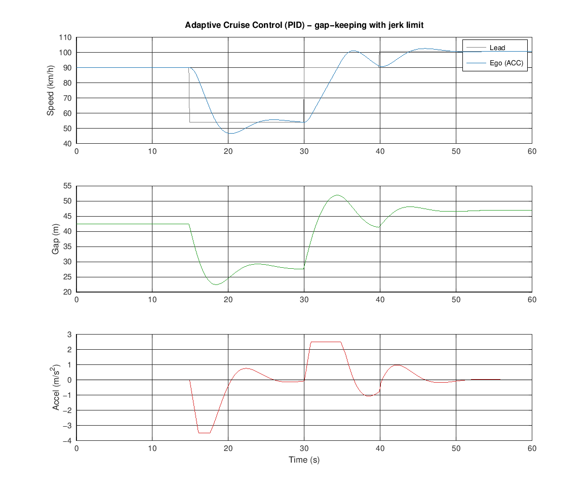
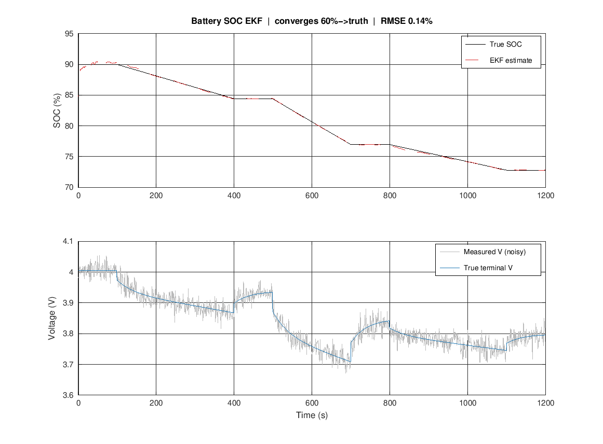

# Vehicle Control & Estimation — MATLAB Experiments

A set of small MATLAB experiments I built to implement the core **control and estimation algorithms** from my coursework myself — classical feedback control, safety decision logic, and optimal state estimation — applied to vehicle problems.

The goal was to move past calling library functions and actually code the algorithms: tune a PID loop with anti-windup, build a finite-state safety controller, and write a Kalman filter from the equations up. No toolboxes, no black boxes.

Everything here runs in **base MATLAB** (no toolboxes; validated in GNU Octave). Each folder has its own README and a figure generated by the code.

---

## The experiments

Three algorithmic building blocks, increasing in sophistication — from classical feedback, to decision logic, to optimal estimation.

### 1 · Adaptive Cruise Control (PID) → [`adaptive-cruise-pid/`](adaptive-cruise-pid)
A PID controller that follows a lead vehicle at a constant time-gap, with integral anti-windup, acceleration limits, and a jerk constraint for comfort. Holds a safe gap (min ~22 m) through a lead slow-down and speed-up with no collision.



### 2 · Automatic Emergency Braking (TTC) → [`aeb-ttc/`](aeb-ttc)
A finite-state safety controller using Time-To-Collision to escalate through warning → partial brake → full brake, with a noisy forward sensor. The productized version of my EGR 306 AEB project — stops ~0.78 m short of the obstacle from 50 km/h.


### 3 · Battery SOC Estimation (EKF) → [`battery-soc-ekf/`](battery-soc-ekf)
An Extended Kalman Filter estimating lithium-ion State of Charge from noisy voltage/current on a 1st-order RC cell model. Converges from a deliberately wrong 60% initial guess to the true SOC at ~0.14% RMSE — a core Battery Management System technique.



---

## Running any experiment

Open the `.m` file in MATLAB and run it, or from the command window:

```matlab
>> cd battery-soc-ekf
>> soc_ekf        % prints metrics and regenerates demo.png
```

The Kalman filter is implemented from the prediction/update equations directly — no toolboxes required.

---

*Built by Ujjwal Singla · B.S. Engineering (Automotive Systems), Arizona State University. MIT licensed. One of three repos exploring how MATLAB applies to vehicle engineering.*
