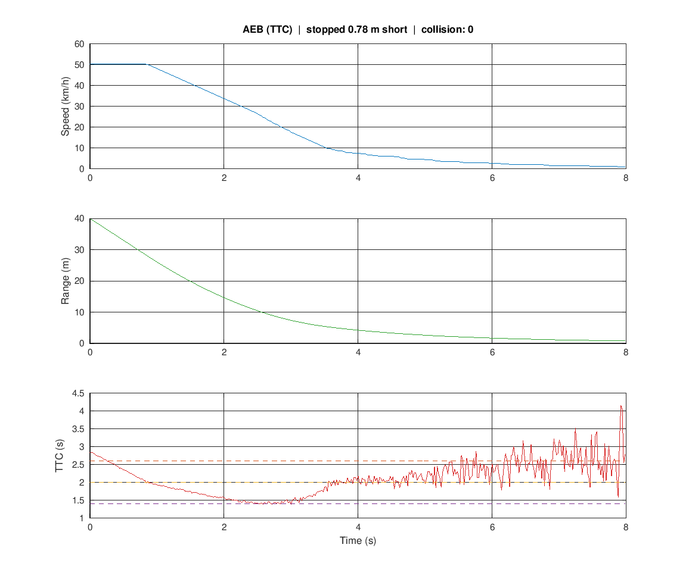

# Automatic Emergency Braking (Time-To-Collision)

> A noisy forward sensor feeds a Time-To-Collision controller that escalates through forward-collision warning -> partial brake -> full brake. The productized EGR 306 project.



## How it works
- `TTC = range / closing_speed`; staged thresholds (2.6 / 2.0 / 1.4 s)
- Forward sensor model with Gaussian range noise
- Reports final stopping gap and collision flag

## Run it
```matlab
>> aeb        % prints metrics and saves demo.png
```

## Result
Stops **0.78 m short** of the obstacle from 50 km/h with no collision, despite sensor noise.

## What this demonstrates
Safety-critical state-machine control, sensor-noise handling, and the AEB concept from EGR 306 - now reproducible with a logged stopping distance.

**Stack:** MATLAB (base install - no toolboxes required). Validated in GNU Octave.

---
*Part of the **Vehicle Control & Estimation** MATLAB experiments. MIT licensed.*
